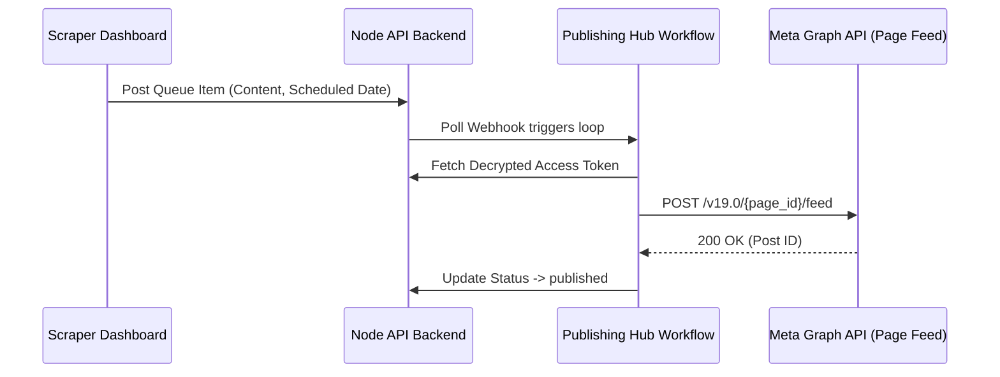

# Facebook Page Integration Setup Guide

This guide details how to link your Facebook Page, get your Page ID, and configure API permissions.

## 1. Create a Facebook Page
1. Log in to your personal Facebook account.
2. Go to [facebook.com/pages/create](https://www.facebook.com/pages/create/).
3. Choose a Page Category and name. Click **Create Page**.

## 2. Retrieve Page ID
1. Navigate to your Facebook Page profile.
2. Go to the **About** tab → **Page Transparency** or **Settings** → **New Pages Experience** → **Page Details**.
3. Copy the numeric **Page ID**.

## 3. Required Permissions Scope
Ensure that the access token you load for your Page has the following permissions enabled:
- `pages_show_list`
- `pages_read_engagement`
- `pages_manage_posts` (needed for publishing feed posts)
- `pages_messaging` (needed for Messenger webhooks)

## 4. Flow diagram: Facebook publishing

