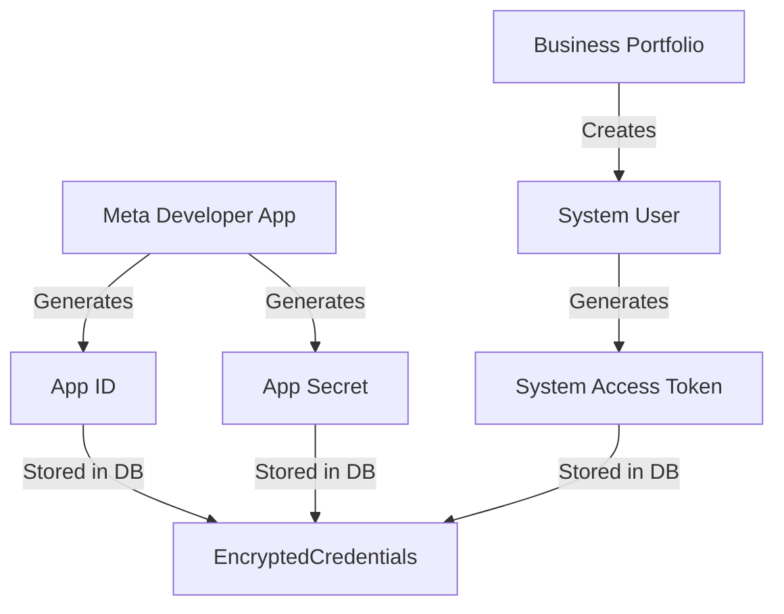

# Meta App & Business Portfolio Configuration Guide

This manual details how to set up your Meta developer application, Business Portfolio, and generate system tokens.

## 1. Create a Meta Business Portfolio
1. Visit the [Meta Business Suite](https://business.facebook.com/).
2. Navigate to **Settings** → **Business Portfolio** → **Create Business Portfolio**.
3. Fill in your business name and verification email details.

## 2. Create a Meta Developer App
1. Go to the [Meta App Dashboard](https://developers.facebook.com/).
2. Click **Create App**.
3. Select **Other** as the use case, then choose **Business** app type (essential for Instagram, Messenger, and WhatsApp scopes).
4. Fill in your App Name and link it to your newly created Business Portfolio.

## 3. Retrieve App Credentials
* **App ID & App Secret**: Navigate to **App Settings** → **Basic** on the left menu. Here you will find the `App ID` and `App Secret` (required for OAuth and token verification).
* **Client Token**: Go to **Settings** → **Advanced** → **Security** tab to copy the `Client Token`.

## 4. Set Up a System User (Highly Recommended for Production)
System Users provide permanent access tokens that do not expire like normal user tokens.
1. Go to **Business Settings** (Business Manager) → **Users** → **System Users**.
2. Click **Add** and create an Admin System User.
3. Assign Assets (link your Facebook Page, Instagram Account, and WhatsApp WABA to this user).
4. Click **Generate Token**. Select the appropriate permissions (listed in the platform-specific guides) and click Generate.
5. Save this token! It is your **System User Access Token** (long-lived).

---

## 🔗 Credentials Mapping Flow

