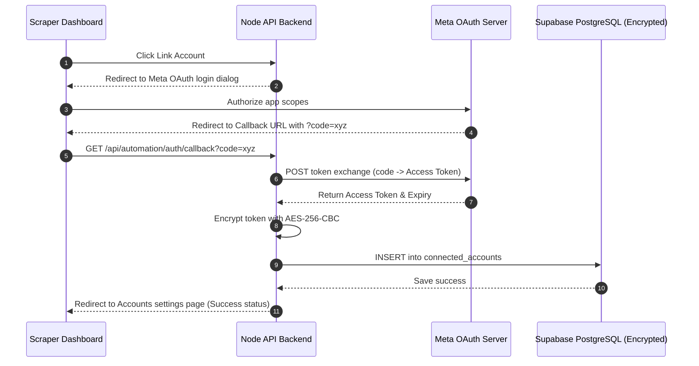

# OAuth & Database Security Protocol

This document explains the OAuth workflow, token storage, and database security mechanisms used in the platform.

## 1. OAuth Sequence Flow



## 2. Token Security & Storage
All raw Access Tokens and App Secrets are **never** stored in plaintext. They are encrypted using node's `crypto` module (`AES-256-CBC` algorithm) with a 32-byte key derived from `process.env.ENCRYPTION_KEY`.

Format in DB:
```
iv_hex:ciphertext_hex
```

## 3. Token Refresh Strategy
Meta access tokens typically last 60 days. The **Sync & Monitoring Hub** regularly validates token validity:
- If a token is detected as expired or invalid, it updates `oauth_status` to `needs_reauth` in PostgreSQL.
- The next time the user logs in to the dashboard, a modal will prompt the user to click **Reconnect** to re-authenticate.
