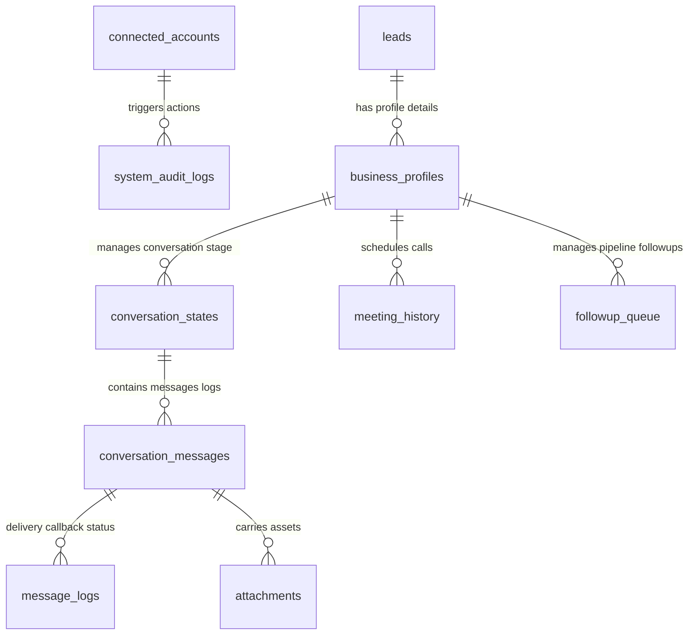

# Database Entity-Relationship (ER) Schema Directory

This document details the database tables structure, column definitions, and primary/foreign key mappings.

## 📊 Database Schema Entity Relationships

---

## 🗄️ Database Tables Directory

### 1. `connected_accounts`
Stores decrypted configurations (secrets masked) and health attributes.
* `id` UUID PRIMARY KEY
* `platform` VARCHAR (facebook, instagram, messenger, whatsapp)
* `account_name` TEXT
* `app_id` TEXT
* `encrypted_credentials` TEXT (encrypted string containing System User Token, WABA ID, Page ID, etc.)
* `oauth_status` VARCHAR (connected, expired, needs_reauth, error)
* `token_expires_at` TIMESTAMPTZ
* `webhook_verification_status` VARCHAR (verified, unconfigured, failed)
* `permissions` JSONB (array of permissions granted)
* `health_status` VARCHAR (healthy, degraded, down)
* `last_tested_at` TIMESTAMPTZ

### 2. `conversation_states`
* `id` UUID PRIMARY KEY
* `business_id` UUID FOREIGN KEY REFERENCES `business_profiles(id)`
* `current_stage` VARCHAR (lead_qualified, contact_initiated, follow_up, closed)
* `last_contacted_at` TIMESTAMPTZ

### 3. `conversation_messages`
* `id` UUID PRIMARY KEY
* `conversation_state_id` UUID FOREIGN KEY REFERENCES `conversation_states(id)`
* `direction` VARCHAR (inbound, outbound)
* `channel` VARCHAR (whatsapp, email, sms, call)
* `body` TEXT

### 4. `automation_publishing_queue`
* `id` UUID PRIMARY KEY
* `platform` VARCHAR
* `account_name` VARCHAR
* `content` TEXT
* `media_url` TEXT
* `scheduled_at` TIMESTAMPTZ
* `status` VARCHAR (scheduled, published, failed)
* `published_id` TEXT

### 5. `automation_workflow_status`
* `name` VARCHAR PRIMARY KEY
* `active` BOOLEAN
* `last_run` TIMESTAMPTZ
* `execution_time` VARCHAR
* `status` VARCHAR

### 6. `message_logs`
* `id` UUID PRIMARY KEY
* `message_id` UUID FOREIGN KEY REFERENCES `conversation_messages(id)`
* `status` VARCHAR (sent, failed)
* `error_message` TEXT

### 7. `system_audit_logs`
* `id` UUID PRIMARY KEY
* `action` VARCHAR
* `details` TEXT
* `user_identifier` VARCHAR
* `created_at` TIMESTAMPTZ
