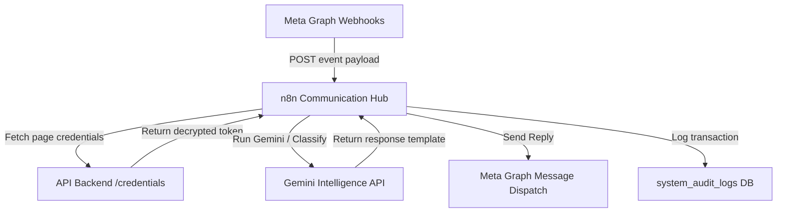

# Webhook Verification & Listener Flow

This document details how Meta webhook verification works and how webhook event logs flow from Meta to n8n to backend.

## 1. Webhook Verification Protocol (GET check)
When you register a webhook URL in the Meta Dashboard, Meta issues a `GET` request with parameters:
- `hub.mode=subscribe`
- `hub.verify_token=<your_verify_token>`
- `hub.challenge=<random_string_challenge>`

Your backend or n8n endpoint must verify that the `verify_token` matches your secret configuration, and return the exact value of `hub.challenge` to verify webhooks.

## 2. Event Delivery Flow (POST payload)
Once verified, Meta POSTs webhook events.

