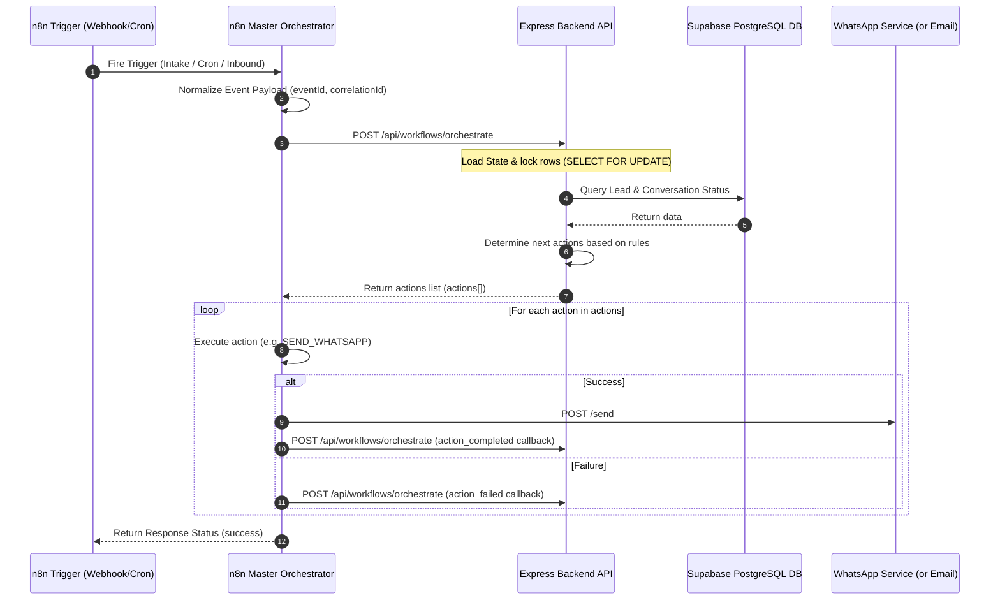

# Outreach Master Orchestrator Architecture

This document specifies the design, operational rules, schema, and API contracts for the unified **n8n Master Orchestrator V4** running on the LeadGen platform.

---

## 1. System Sequence Diagram



---

## 2. Node-by-Node Explanation

1.  **Lead Intake Webhook**: Exposed trigger node listening for new leads.
2.  **WhatsApp Inbound Webhook**: Receives notifications of inbound customer chats.
3.  **15-Min Followup Cron**: Regularly pulls the queue to process due followups.
4.  **6-Hour Maintenance Cron**: Triggers ghost detection, status checks, and data cleanups.
5.  **Normalize Trigger Payload**: A JavaScript execution block that formats trigger events and injects metadata (`eventId`, `correlationId`, `timestamp`, `version`, `source`).
6.  **Call Backend Orchestrator**: Hits `{{ $env.BACKEND_URL }}/api/workflows/orchestrate` with signature verification, passing trace headers.
7.  **Extract Actions List**: Extracts a list of actions (`actions[]`) returned by the backend, or parses backward-compatible `nextAction` values into an array format.
8.  **Split Actions Loop**: A standard split-in-batches loop that processes each action in sequence.
9.  **Action Router Switch**: Directs execution to the correct node based on the action type.
10. **Dispatch WhatsApp Outbound**: Calls external WhatsApp API endpoint `/send`.
11. **Dispatch Email Outbound**: Calls backend endpoint `/api/outreach/message/inbound`.
12. **Action Success Callback**: Reports completion back to the backend using the `action_completed` event contract to commit conversation stage states.
13. **Action Failure Callback**: Reports failures back to the backend using the `action_failed` event contract.
14. **Respond Webhook Call**: Outputs status metadata to the webhook caller.
15. **Error Trigger**: Intercepts unhandled workflow crashes.
16. **Log Workflow Failure**: Posts workflow crash stack traces to `/api/logs`.

---

## 3. Required Environment Variables

Configure these settings inside the n8n environment configuration panel:

```bash
BACKEND_URL="https://leadgen-production.up.railway.app"
WHATSAPP_SERVICE_URL="https://whatsapp-production.up.railway.app"
API_SECRET="yoursecrettokenhash"
```

---

## 4. API Contracts Used

### Inbound Orchestrate Payload from n8n
```json
{
  "eventId": "a1b2c3d4-e5f6-7a8b-9c0d-1e2f3a4b5c6d",
  "correlationId": "execution-id-uuid",
  "timestamp": "2026-07-05T14:49:56Z",
  "version": "4.0.0",
  "source": "Lead Intake Webhook",
  "event": "lead_intake",
  "payload": {
    "name": "Acme Builders",
    "phone": "+919876543210",
    "city": "Mumbai",
    "category": "Construction"
  }
}
```

### Action Response from Backend (supports multiple actions)
```json
{
  "success": true,
  "nextAction": "SEND_WHATSAPP",
  "actionPayload": {
    "phone": "+919876543210",
    "message": "Hey Acme Builders!"
  },
  "actions": [
    {
      "type": "SEND_WHATSAPP",
      "payload": {
        "phone": "+919876543210",
        "message": "Hey Acme Builders!",
        "leadId": "lead-uuid-1",
        "messageId": "msg-uuid-1"
      }
    }
  ]
}
```

### Callback Payload: `action_completed`
```json
{
  "event": "action_completed",
  "payload": {
    "leadId": "lead-uuid-1",
    "actionType": "SEND_WHATSAPP",
    "status": "success",
    "messageId": "msg-uuid-1"
  }
}
```

---

## 5. Error & Retry Strategy

*   **HTTP Request Retries**: All HTTP requests are set to **3 retries** with **3000ms delay** to handle transient network issues.
*   **Workflow Level Failure Catch**: The `Error Trigger` node intercepts unhandled node crashes and sends a structured payload back to the backend `/api/logs` endpoint.
*   **Duplicate Event Prevention**: Event triggers pass unique execution hashes inside request payloads. The backend maintains transactional state locks (`SELECT FOR UPDATE`) on conversation states to avoid concurrent updates.

---

## 6. Scalability & Future Extension Points

*   **Concurrency**: By delegating execution logic to the backend and keeping n8n stateless, n8n can scale to thousands of concurrent webhook executions.
*   **New Outreach Channels**: Adding support for a new channel (e.g., SMS, LinkedIn) only requires:
    1.  Defining a new action enum (e.g., `SEND_SMS`) on the backend.
    2.  Adding a new routing branch to the `Action Router Switch` inside n8n.
