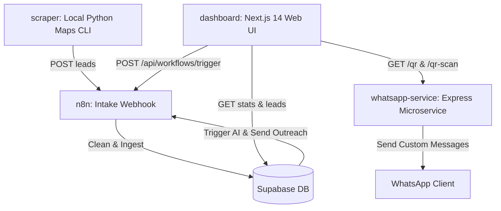

# Project Context & Handover Notes

This document provides a comprehensive overview of the **WHSoftec Lead Gen Automation** monorepo for use by other AI models (such as Claude).

---

## 1. System Architecture

The codebase is organized as a monorepo containing three core services and integration scripts:



### Core Components
1. **`dashboard/`**: Next.js 14 App Router, TypeScript, and Tailwind CSS. Acts as the control panel.
2. **`whatsapp-service/`**: Express microservice wrapping `whatsapp-web.js` and Puppeteer. Handles WhatsApp authentication and message dispatch.
3. **`scraper/`**: Local Python CLI script (`main.py`) that extracts business leads from Google Maps and sends them to the n8n ingestion webhook.
4. **`n8n-workflows/`**: JSON configuration exports of the n8n workflow pipelines running on Railway.

---

## 2. Work Accomplished

### A. WhatsApp Microservice (`whatsapp-service/`)
- **Railway Crash Loop Resolved**: Synchronous lock purging executed using `execSync` right before client initialization to clear any stale Chromium locks:
  ```javascript
  execSync('find /app/.wwebjs_auth -name "Singleton*" -delete 2>/dev/null || true');
  ```
- **Puppeteer Flags**: Optimized args to avoid container memory limits (`--no-sandbox`, `--disable-dev-shm-usage`, `--disable-gpu`) and removed conflicting flags (`--single-process`, `--no-zygote`).
- **Resilient Startup Order**: Reordered Express to listen on the port **before** initializing Puppeteer/Chromium so that endpoints like `/health` and `/qr-image` respond immediately.
- **Scannable Image Endpoint**: Implemented `/qr-image` using the `qrcode` NPM package to serve a scannable QR HTML image instead of raw terminal text.
- **Authentication Strategy**: Pinned `authStrategy` to write to the `/app/.wwebjs_auth` absolute directory to persist sessions inside Railway's persistent volume mounts.

### B. Next.js Dashboard UI (`dashboard/`)
- **Shell layout (`layout-client.tsx`)**: Integrates responsive sidebar navigation, global toast notifications (`react-hot-toast`), and automatic WhatsApp microservice health polling.
- **Overview Dashboard (`page.tsx`)**: Renders real-time statuses (Total, Pending, Sent, Converted), top cities/categories data, recent leads, and manual workflow triggers.
- **Leads Manager (`leads/page.tsx`)**: Formats leads inside a table with:
  - Sticky filters (search, status, city, category).
  - Bulk selection (bulk delete, bulk mark as replied, bulk send WhatsApp).
  - A tabbed modal ("View AI Messages") showing preview bubbles of AI-generated WhatsApp and email copy before dispatching.
- **Diagnostics (`settings/page.tsx`)**: Displays latency health checks for Supabase, n8n, and WhatsApp, alongside database purging capabilities.

---

## 3. Current Config & Environments

### Vercel (Next.js UI) Variables
```env
NEXT_PUBLIC_SUPABASE_URL=your-supabase-url
NEXT_PUBLIC_SUPABASE_ANON_KEY=your-anon-key
SUPABASE_SERVICE_ROLE_KEY=your-service-role-key
WHATSAPP_SERVICE_URL=https://leadgen-automation-production.up.railway.app
WHATSAPP_API_SECRET=your-secret
N8N_WEBHOOK_BASE_URL=https://n8n-production-b85da.up.railway.app
NEXT_PUBLIC_N8N_WEBHOOK_BASE_URL=https://n8n-production-b85da.up.railway.app
RESEND_API_KEY=your-resend-key
RESEND_FROM_EMAIL=onboarding@resend.dev
N8N_AI_TRIGGER_URL=n8n-manual-ai-webhook
N8N_OUTREACH_TRIGGER_URL=n8n-manual-outreach-webhook
```

### Railway (WhatsApp service) Variables
* **`PUPPETEER_EXECUTABLE_PATH`**: `/root/.nix-profile/bin/chromium`
* **`API_SECRET`**: Set to match `WHATSAPP_API_SECRET` from Vercel to secure `/send` proxy calls.

---

## 4. Pending Tasks & Handover Directions

1. **Volume Persistence Verification**:
   - Ensure the Railway volume is mounted to `/app/.wwebjs_auth` inside the `whatsapp-service` deployment configuration.
   - Run a test scan at `/qr-scan` or `/qr-image`.
   - Once authenticated, check if restarting the service retains session status (`whatsapp_ready: true`) without requiring rescanning.

2. **Triggering Workflows from Dashboard**:
   - Verify that clicking "Run AI Personalise" and "Send Outreach" in the Dashboard sends requests successfully to `/api/workflows/trigger-ai` and `/api/workflows/trigger-outreach`.
   - Map the URLs returned by your n8n console to Vercel's `N8N_AI_TRIGGER_URL` and `N8N_OUTREACH_TRIGGER_URL` environment variables.

3. **Verify Intake webhook integration**:
   - Verify that submitting a manual lead on the `/scraper` page of the dashboard pushes the payload correctly to `/api/leads/quick-add`, which proxies it directly to `N8N_WEBHOOK_BASE_URL/webhook/leads`.
   - Verify that the n8n intake flow successfully validates, deduplicates, and saves the record in Supabase.
