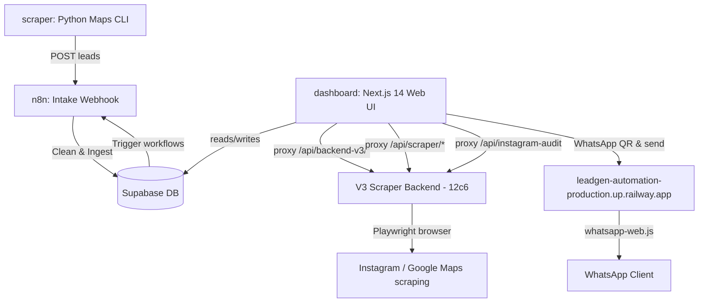

# Project Context & Handover Notes

This document provides a comprehensive overview of the **WHSoftec Lead Gen Automation** monorepo for use by AI agents or new developers.

> **Last updated**: 2026-07-08 by agent — reflects all fixes and discoveries made during extended debugging sessions.

---

## 1. System Architecture



### Core Components
1. **`dashboard/`**: Next.js 14 App Router, TypeScript. Control panel for all operations.
2. **`backend/`**: Express.js backend (local dev / Railway). Handles WhatsApp, Supabase writes, n8n triggers.
3. **`scraper/`**: Local Python CLI (`main.py`) extracting leads from Google Maps → n8n webhook.
4. **`n8n-workflows/`**: JSON exports of n8n pipeline configs running on Railway.
5. **`agent-brain/`**: Agentic backend for intelligent lead processing.

---

## 2. ⚠️ CRITICAL: Backend URL Mapping

There are **multiple Railway backends**. Getting these confused breaks everything. Here is the definitive map:

| URL | Service | Purpose | Health |
|-----|---------|---------|--------|
| `https://leadgen-automation-production-12c6.up.railway.app` | **V3 Scraper Backend** | Instagram audit, Google Maps scraping, Playwright browser + workers. **PRIMARY for all scraping features.** | `{ status: 'ok', browser: 'Healthy', workers: 'Active' }` |
| `https://scraper-auto.up.railway.app` | V3 Scraper Backend (alt) | Same service as 12c6 but session may expire. Use 12c6 as primary. | `{ status: 'ok', browser: 'Healthy', workers: 'Active' }` |
| `https://leadgen-automation-production.up.railway.app` | **WhatsApp Service** | WhatsApp QR scanning, message sending ONLY. Does NOT have Instagram/scraper routes. | `{ status: 'ok', whatsapp_ready: false }` |
| `https://lead-intelligence-backend-production.up.railway.app` | Old backend | Health OK but no browser/workers. Do NOT use for Instagram scraping. | `{ status: 'ok', database: 'connected' }` |
| `https://n8n-production-4cbd.up.railway.app` | n8n workflows | Automation workflow engine | — |

### DB Config (meta_config table in Supabase)
These keys control which backend the Next.js proxy uses at runtime (fallback if env vars not set):
```
V3_BACKEND_URL         = https://leadgen-automation-production-12c6.up.railway.app
V3_BACKEND_URL_SECONDARY = https://scraper-auto.up.railway.app
```

### Local .env.local (dashboard/)
```env
NEXT_PUBLIC_SUPABASE_URL=https://nefgezqgrfvqegmduzce.supabase.co
NEXT_PUBLIC_SUPABASE_ANON_KEY=eyJhbGci...
SUPABASE_SERVICE_ROLE_KEY=eyJhbGci...
WHATSAPP_SERVICE_URL=https://leadgen-automation-production-12c6.up.railway.app
WHATSAPP_API_SECRET=27pwgfjvq491aircy8lh6nz3eb5mkus0
N8N_WEBHOOK_BASE_URL=https://n8n-production-4cbd.up.railway.app
TINYFISH_API_KEY=sk-tinyfish-...
DASHBOARD_PASSWORD=wrongpassword
```

---

## 3. ⚠️ CRITICAL: Middleware Auth Whitelist

**File**: `dashboard/src/middleware.ts`

The Next.js middleware checks for a `zarss_session` cookie and **redirects unauthenticated requests to `/login`**. POST requests to `/login` (a page route) return **405 Method Not Allowed**. This caused ALL proxied API calls to fail when made without a browser session (e.g., from n8n, external services, Node.js test scripts).

### Current Whitelist (paths that bypass auth):
```typescript
pathname.startsWith('/_next') ||
pathname.startsWith('/api/email/send') ||
pathname.startsWith('/api/login') ||
pathname.startsWith('/api/meta') ||          // Meta/Instagram API routes
pathname.startsWith('/api/automation') ||    // Automation module
pathname.startsWith('/api/backend-v3') ||    // V3 scraper proxy
pathname.startsWith('/api/scraper') ||       // Scraper proxy
pathname.startsWith('/api/instagram-audit') || // Instagram audit endpoint
pathname.startsWith('/api/instagram-logs') ||  // Instagram log polling
pathname.startsWith('/automation') ||
pathname.startsWith('/favicon.ico') ||
pathname.startsWith('/fonts') ||
pathname === '/login'
```

> **Rule**: Any new `/api/*` route that needs to be called from n8n workflows, external scripts, or the backend MUST be added to this whitelist, otherwise it returns 405.

---

## 4. ⚠️ CRITICAL: Vercel Proxy Architecture

### Why `/api/backend-v3/[...path]` was broken
The catch-all proxy route `dashboard/src/app/api/backend-v3/[...path]/route.ts` was NOT being reached because:
1. **TypeScript build errors** were silently failing the Vercel build → old deployment served
2. **Middleware** was redirecting unauthenticated POST requests → 405

### Dedicated Endpoints (preferred over catch-all)
Instead of relying on the `[...path]` catch-all, we created **dedicated endpoints** for critical features:

| Endpoint | File | Purpose |
|----------|------|---------|
| `POST /api/instagram-audit` | `dashboard/src/app/api/instagram-audit/route.ts` | Instagram profile audit. Calls `12c6/api/test/instagram` |
| `GET /api/instagram-logs` | `dashboard/src/app/api/instagram-logs/route.ts` | Live log polling for Instagram analyzer UI |

### Backend URL Resolution Order (in all proxy routes)
```typescript
const backendUrl =
  process.env.V3_BACKEND_URL ||        // 1. Vercel env var (if set)
  dbBackendUrl ||                        // 2. Supabase meta_config.V3_BACKEND_URL
  'https://leadgen-automation-production-12c6.up.railway.app'  // 3. Hardcoded fallback
```
**Note**: Do NOT include `WHATSAPP_SERVICE_URL` in this chain for scraper routes — it points to the WhatsApp service which has no scraper endpoints.

---

## 5. TypeScript Build Patterns (avoid these errors)

These TypeScript errors broke Vercel builds silently. Watch out for them:

```typescript
// ❌ WRONG: process.env returns string | undefined, but getValidUrl expects string | null
getValidUrl(process.env.V3_BACKEND_URL)

// ✅ CORRECT: coerce undefined → null
getValidUrl(process.env.V3_BACKEND_URL ?? null)

// ❌ WRONG: Supabase returns PromiseLike<T> which has no .catch()
supabaseAdmin.from('table').insert({...}).then(...).catch(...)

// ✅ CORRECT: wrap in Promise.resolve() to get a real Promise
Promise.resolve(supabaseAdmin.from('table').insert({...})).then(...).catch(...)

// ❌ WRONG: accessing optional properties not in type definition
lead.notes   // if 'notes' is not in ScrapedLead type

// ✅ CORRECT: cast to any for optional/dynamic properties
(lead as any).notes
```

---

## 6. Instagram Analyzer Page

**URL**: `/instagram-analyzer`
**File**: `dashboard/src/app/instagram-analyzer/page.tsx`

The page calls:
- `POST /api/instagram-audit` — submits username, gets full profile report
- `GET /api/instagram-logs` — polls every 1s for live backend logs during audit

Both endpoints forward to `https://leadgen-automation-production-12c6.up.railway.app/api/test/instagram`.

**Tested working accounts**: `smritifyp` (→ SMRITI), `instagram` (→ Instagram official)
**Average response time**: ~22-25 seconds (Playwright scraping is slow by nature)

---

## 7. Google Scraper Page

**URL**: `/scraper`
**File**: `dashboard/src/app/scraper/page.tsx`

Uses two configurable backend URLs stored in `localStorage`:
- **Primary**: `https://scraper-auto.up.railway.app` (default)
- **Secondary**: `https://leadgen-automation-production-12c6.up.railway.app` (default)

The proxy at `dashboard/src/app/api/scraper/[...path]/route.ts` reads these from request headers (`x-backend-primary`, `x-backend-secondary`) and routes accordingly.

---

## 8. Git Branch Strategy

| Branch | Purpose | Vercel URL |
|--------|---------|------------|
| `main` | Production deployment | `https://leadgen-automation.vercel.app` |
| `beta-agent` | Active development | `https://leadgen-automation-git-beta-agent-harrypeter07s-projects.vercel.app` |

**Workflow**: Commit to `beta-agent` → push → merge to `main` → push. Both branches must stay in sync.

---

## 9. Pending / Known Issues

1. **`followers_count` returns `undefined`** in Instagram report — the field may be named differently in the V3 backend response. Check `report.followers` or `report.followers_count` in the actual API response.
2. **`scraper-auto` session expires** — the Instagram session on `scraper-auto.up.railway.app` expires periodically (returns `session_expired`). Always use `12c6` as primary for Instagram.
3. **Vercel env vars** — `V3_BACKEND_URL` and `WHATSAPP_API_SECRET` are NOT set in Vercel's dashboard. The app falls back to DB lookup. If DB is unreachable, it uses hardcoded 12c6 fallback.
4. **WhatsApp QR** — `whatsapp_ready: false` on the main backend — requires QR scan to activate.
